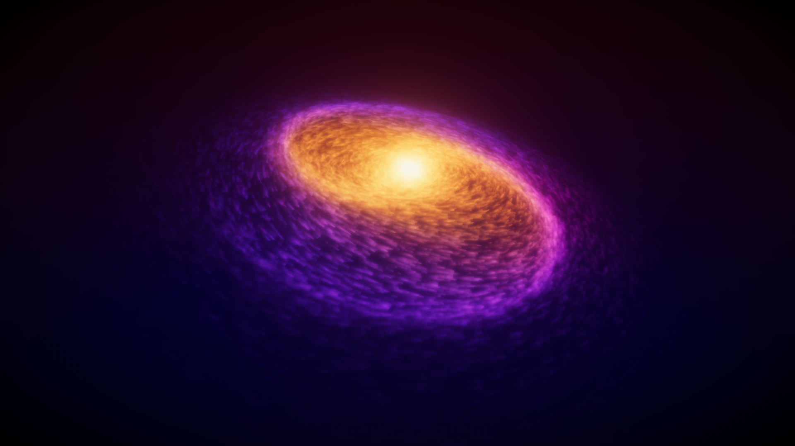
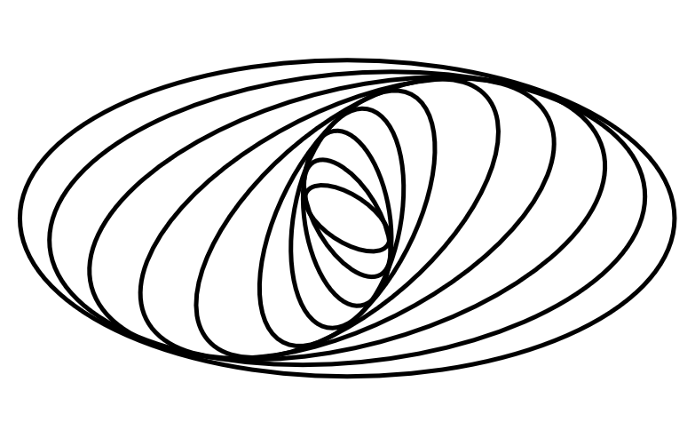



# Galaxy Renderer

This project tries to render an approximation of a spiral galaxy (with some non-realistic fancy colors).

The structure of a real-world spiral galaxy is approximated using the [Density Wave Theory](https://en.wikipedia.org/wiki/Density_wave_theory) which in short says that
the particles (stars / matter in the galaxy) are moving along ellipses shaped and rotated in a specific way to form the spiral arms as well as the overall shape.

The following diagram shows an example of a such an approximated spiral galaxy structure. The important part is how the spiral arms are formed where multiple ellipses are close to each other:

To render the galaxy, a few million semi-transparent particles are spawned and moved along the ellipses. 
This project contains two different approaches for rendering the particles: The first approach uses a custom vertex and fragment shader to render the particles, the second one uses the Unity Visual Effects Graph built in Unity's HDRP.
Combined with a few post-process effects this results in the galaxy displayed above.
